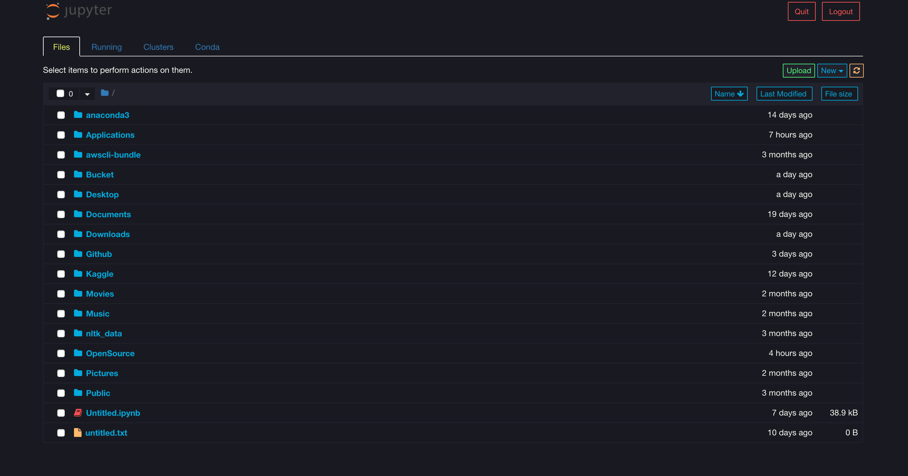
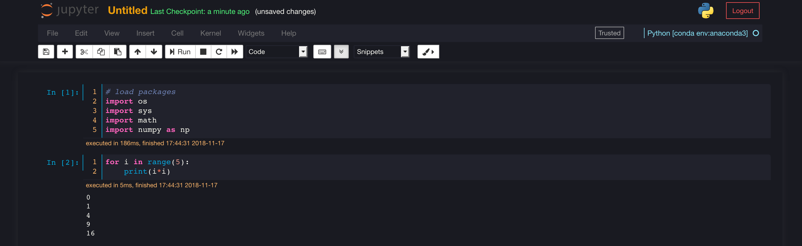
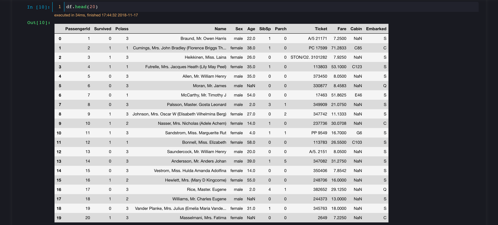
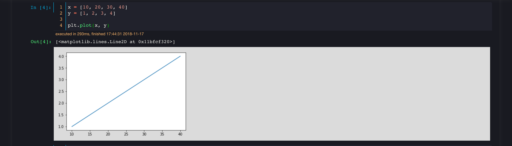
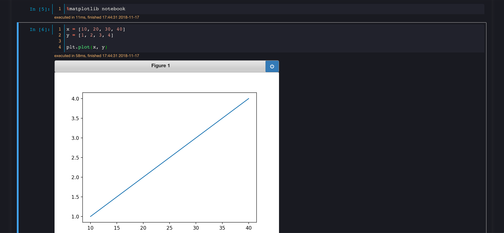

# dark-jupyter 

## Dark theme for Jupyter Notebook!

|    Author    | Version    | License |
| :----------: | :----------: | :----------: |
| Kumar Nityan Suman |  |  |

**Dark-Jupyter** theme is specially designed for Jupyter Notebook. It works on any version of the notebook. It supports all different versions of python and works in synch with any other jupyter extensions.

#### Home

#### Loading Packages

#### Dataframe View

#### Basic Plot

#### Interactive Plot

### Requirements
* Python 2.7+, 3.0+
* Jupyter ([Anaconda](https://www.continuum.io/downloads) recommended)
* Matplotlib

### How to support me?
I firmly believe that software is best served open and, as such, am committed to providing free and easy access to all my code. If you're sitting on some extra time and enjoy using a package I've developed, then any amount of help is *greatly* appreciated. **We are open to any kind of suggestions regarding style and structure of the theme*.*

Please click on the *Star* button of this repository (present at the top-right corner) to show some extra appreciation.

 
